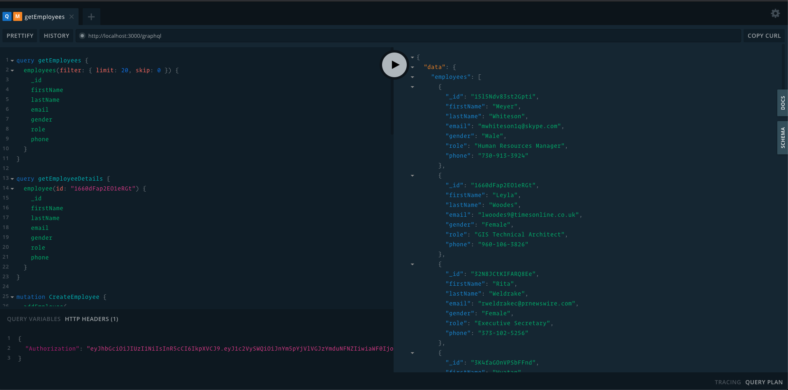

<p align="center">
  
</p>

## What I did

- Authentication & Employee GraphQL API
- Full test coverage
- In memory database with `nedb`
- Embedded initial data set

## Requirements

- Node v12.18.2 (should run on any version after 7)

## Step 1: Clone the repo

## Step 2: Setup environment variables

Copy `.env.example` to `.env` & configure them.

## Step 2: Start the server

Install packages:

```
npm i
```

Build:
```
npm run build
```

Start the server

```bash
npm run start
```

## Run tests

```
$ npm run test
```

## Queries & mutations

Let's play with the backend. Go to host URL, in my case; it is `http://localhost:4000/`

Authentication API's:

```javascript
mutation SignupUser {
  signUp(email: "hi@joynal.dev", password: "123456") {
    token
  }
}

mutation LoginUser {
  login(email: "hi@joynal.dev", password: "123456") {
    token
  }
}
```

Employee API's:

Before making request place `Authorization` with jwt token. Note: place jwt token without keyword like `Token` or `Bearer`, do not need these.

```javascript
query getEmployees {
  employees(filter: { limit: 20, skip: 0 }) {
    _id
    firstName
    lastName
    email
    gender
    role
    phone
  }
}

query getEmployeeDetails {
  employee(id: "1660dFap2EO1eRGt") {
    _id
    firstName
    lastName
    email
    gender
    role
    phone
  }
}

mutation CreateEmployee {
  addEmployee(
    input: {
      firstName: "Joynal"
      lastName: "Joynal"
      email: "joynal@gmail.com"
    }
  ) {
    _id
    firstName
    lastName
    email
  }
}

mutation updateEmployee {
  updateEmployee(id: "1660dFap2EO1eRGt", input:{
    phone: "0999346"
    firstName: "Jabed"
    lastName: "Bangali"
  }) {
    _id
    firstName
    lastName
    phone
  }
}

mutation DeleteEmployee {
  deleteEmployee(id: "1660dFap2EO1eRGt") {
    _id
  }
}
```

## Generate dummy data

Data set already embedded into the filesystem. In case you want to regenerate it, here is how to do it.

```
$ node dis/test/seed.js
```

## Back to the initial data set

Just remove your changes, you can easily do it by git:

```bash
git checkout .
```

## Author

**Joynal Abedin** - [Joynal](https://twitter.com/joynaluu)

## License

This project is licensed under the MIT License - see the [license](./license) file for details
